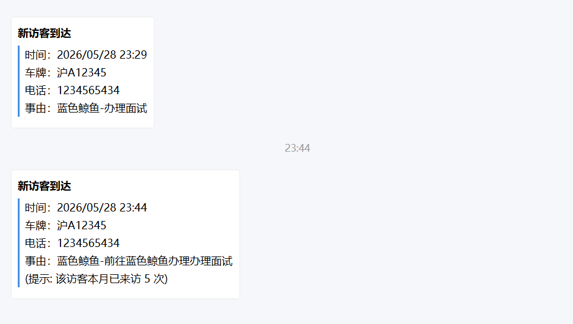
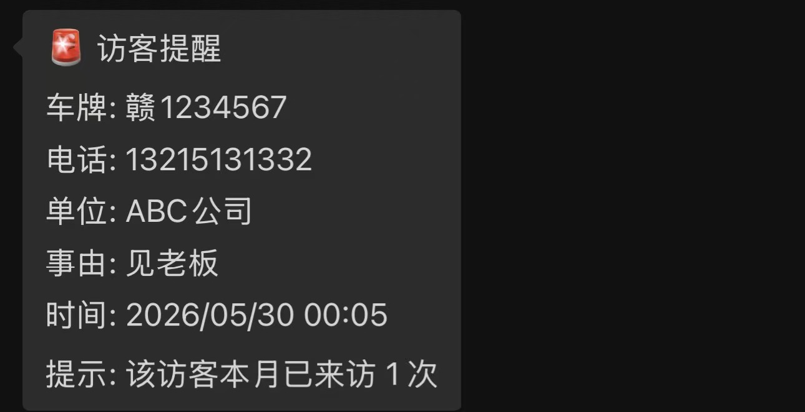
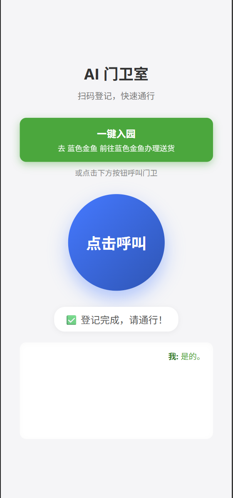
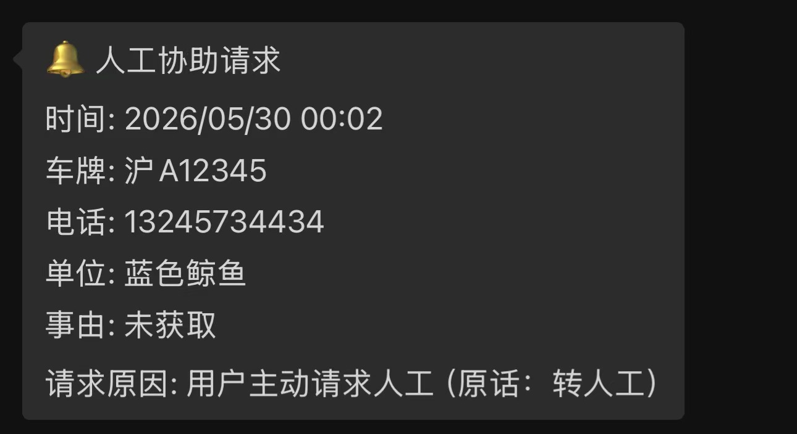
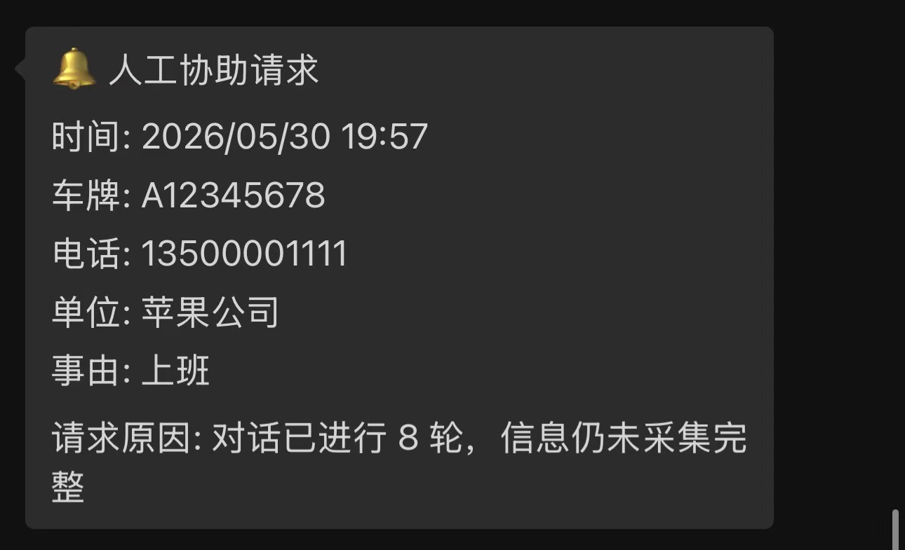
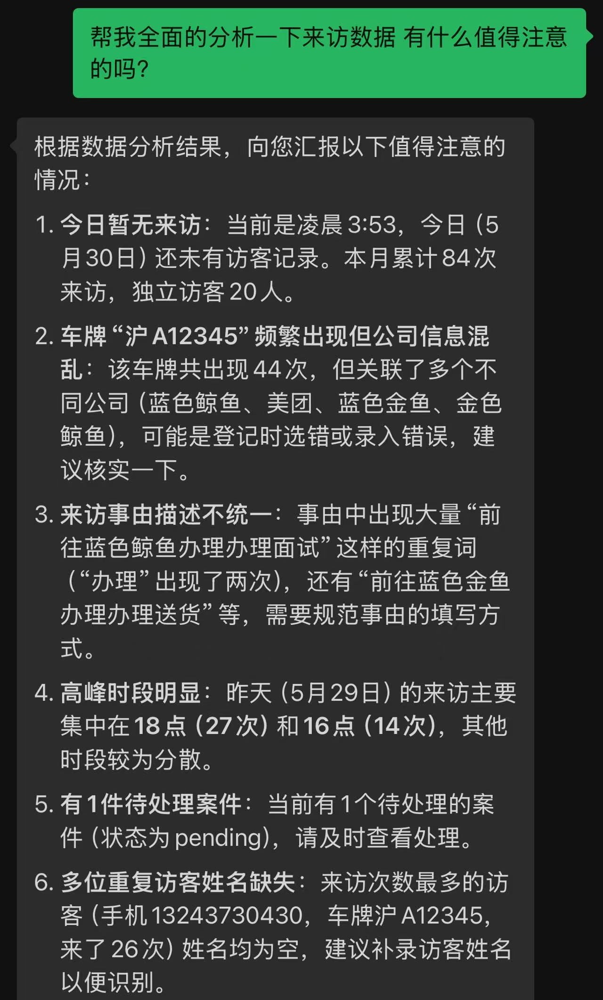
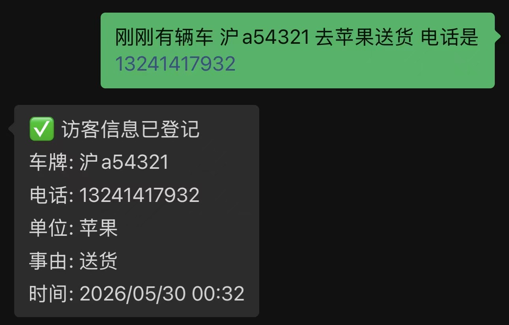
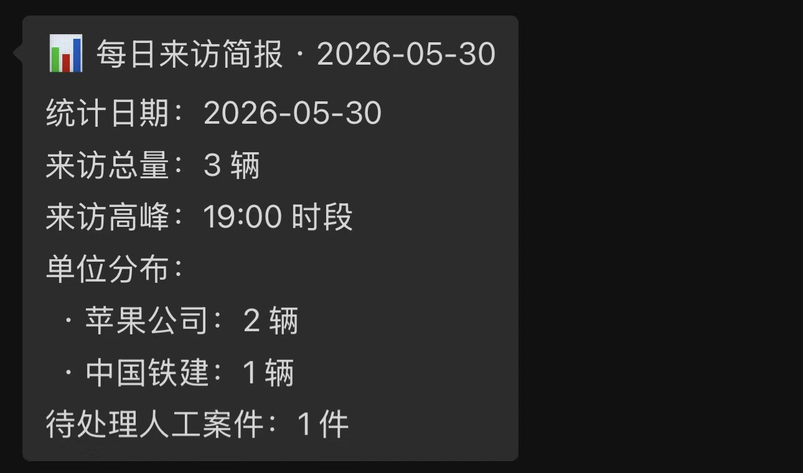

# Day 1

## 语音接入：绕开国内管控的替代方案

开发遇到的第一道坎就是国内对语音外呼的严格管控。文档里提到的 Twilio 已退出中国市场，不再提供境内号码的呼出服务；阿里云语音则早已收紧了个人开发者的准入门槛，必须按运营商要求进行实名登记及话术审核备案才能申请。走传统"主动拨号"这条路基本堵死了。

最终选择的替代方案是：**扫码后跳转 H5 网页，访客点击按钮，由浏览器发起 WebRTC 语音通话，后端通过 WebSocket 与火山引擎对话 API 双向流式传输音频**。

这个方案有几个明显的好处：

- 不需要任何运营商资质，门槛为零
- 几乎没有呼出延迟，点击即连
- 天然跑在 HTTPS 环境里，音频权限申请流程标准化

代价是无法从通话链路里直接拿到访客手机号，只能在对话中让 AI 开口询问。不过访客识别这块用了另一个思路：页面加载时在 `localStorage` 里随机生成一个 UUID 并持久化，同时查库比对。如果是老访客，就能在数据库里找到对应的历史记录，这部分在后面的"回访识别"里细说。

---

## 语音模型：放弃 OpenAI，选择火山引擎

模型选型上纠结了一段时间。OpenAI Realtime API 在国内网络环境下的连通性实在难以保证，延迟抖动大，不适合用在需要流畅口语交互的场景。

最终用的是**字节跳动火山引擎的实时对话 API**（`volc.speech.dialog`），通过 WSS 长连接与后端直连。选它主要有三个理由：

1. **中文发音更自然**——对话风格口语化，不会有机器腔，和"门卫"这个人设匹配度更高
2. **延迟更低**——国内节点，RTT 比海外服务少一个数量级
3. **成本可控**——按字符计费，对于信息收集这种对话轮次有限的场景，整体花费很少

音频格式定为 PCM 16-bit、单声道，上行 16kHz（ASR 端），下行 24kHz（TTS 端）。

---

## 微信通知：从企业微信到 iLink 的迂回

### 第一版：企业微信

最初用的是企业微信的消息推送接口，验证通过后确实能成功推送来访提醒。

<p align="center">
  
  <br><em>企业微信消息推送效果</em>
</p>

但企业微信做到一半就卡住了——如果要实现"保安在同一窗口用自然语言查询记录"这个功能，就必须接入企业微信的 Webhook 或者内部应用消息接收，前置流程繁琐（公网 IP 白名单、消息加解密、Token 校验……）。更大的问题是：企业微信和普通微信本来就是两个 App，让保安再多装一个并不理想。

我也考虑过单独建一个数据库可视化网页，让 LLM 在那里处理自然语言查询，然后把链接发到企业微信。但这样一来，接收通知和查询数据就分散在两个地方，体验上很割裂。

### 第二版：直接实现 iLink 客户端

我知道 OpenClaw 可以接入微信的 ClawBot，但为了一个数据库查询功能单独跑一个 OpenClaw 实例，代价有点大。搜了一圈之后发现类似产品挺多，再往下追就翻到了开源项目 [cc-weixin](https://github.com/hao-ji-xing/cc-weixin.git)。

读完源码后发现，微信 ClawBot 背后走的是 **iLink 协议**，核心是一个标准的 **HTTP 长轮询（Long Polling）循环**：客户端持续向 `https://ilinkai.weixin.qq.com` 请求，挂起等待，有新消息时服务端才返回，然后立即发下一次请求。这个逻辑用纯 Python asyncio 实现起来并不复杂。

最终在 FastAPI 后端里写了一个轻量级的异步 iLink 客户端，完整替代了 OpenClaw 的这部分功能。整个核心逻辑不到 300 行，没有任何额外框架依赖。

### 最终效果

整条链路跑通后是这样：

```
司机扫码 → H5 页面 → WebSocket 语音通话（火山引擎）
         → LLM 输出结构化 JSON → 写入 SQLite
         → 通过 iLink 推送微信通知给保安
         ↕
    保安在同一对话框用自然语言查询历史记录
```

选择留在普通微信而不是企业微信，主要是考虑到保安平时就用微信，不需要额外安装 App，并且"接收通知 + 自然语言问答"在一个对话框里完成，比在两个地方切来切去更顺手。

<p align="center">
  
  <br><em>访客登记完成后通过 iLink 推送至保安微信的提醒卡片</em>
</p>

---

## 额外功能：回访识别与一键回访

访客打开 H5 页面时，前端会检查 `localStorage` 里有没有 UUID。没有就随机生成一个并写入；有的话就带着这个 UUID 去查库，看有没有历史来访记录。

如果是老访客，页面会额外显示一个**回访快捷按钮**，AI 的 System Prompt 里也会带上上次的车牌、手机、常去单位等信息：

> *"张师傅，还是跟上次一样去华为吗？"*

访客只需要回答"是"，AI 就直接输出带完整信息的 JSON，整个流程不到 10 秒，比重新问一遍省去了大半时间，也节省了不少 token 消耗。

<p align="center">
  
  <br><em>老访客一键回访界面（含历史行程预填）</em>
</p>

---

## 通话字幕

通话过程中，AI 的回复会实时以文字形式显示在页面上。这个功能在文档需求里没有提，但实现起来成本很低（TTS 流式返回时文本和音频是分开的，直接把文本推给前端就行），而且对于不方便外放、听力不太好的访客或是背景音嘈杂的情况来说体验提升明显——这也是纯电话方案天然做不到的。

---

## 后续想实现的功能（Day 1 末）

- 数据库可视化页面（单独一个后台地址，写死 admin 账号防止数据泄露）
- 点击接通后如果 2 秒内没有声音，AI 主动开口
- 文字输入兜底（考虑无法说话的访客），但不是当前优先级
- 呼叫保安人工协助按钮——避免陷入"用户说叫人，AI 反复追问信息"的死循环

---

# Day 2

## 转人工机制

Day 2 首先补上了 Day 1 留的坑：转人工。

触发条件是多层的，优先级从高到低：

1. **用户明确要求**——说出"叫保安"、"我要人工"之类的关键词，AI 立即一句"好的，稍等"，然后在新行输出 `===HUMAN_TRANSFER===` 信号，后端捕获后推送"人工协助请求"到微信
2. **AI 自主判断**——System Prompt 里明确授权 AI 在感知到访客明显不耐烦、或反复几轮都无法收集齐信息时，主动发出转人工信号
3. **兜底**：对话轮数超过阈值且信息仍不完整，自动转人工

转人工后，后端会在数据库的 `pending_human_cases` 表里留一条记录，把已收集到的部分信息也存下来，方便门卫接手时快速了解情况。

<p align="center">
  
  &nbsp;&nbsp;&nbsp;&nbsp;
  
  <br><em>左：用户主动触发转人工 &nbsp;&nbsp;&nbsp; 右：对话轮数超阈值后兜底转人工</em>
</p>

---

## 保安侧：微信自然语言补录

门卫在微信对话框里用自然语言发一条消息，后端的 LLM 会判断意图并分三类处理：

| 类型 | 示例 | 处理方式 |
|------|------|----------|
| **补录访客** | "刚那辆车沪A12345，手机138xxxx，去华为送货" | LLM 解析为结构化 JSON → 写库 → 回复确认 |
| **查询数据库** | "今天来了几辆车" / "找一下沪A12345的记录" | LLM 生成 SQL → 执行 → 二次 LLM 汇报结论 |
| **一般对话** | "帮我看看现在有哪些待处理" | 直接自然语言回答 |

补录时同样做了数据合并：优先按手机号或车牌号匹配已有用户，命中就更新空白字段，不覆盖已有信息；没匹配到才创建新用户。同时会把对应的 `pending_human_cases` 记录标记为 `resolved`。

<p align="center">
  
  &nbsp;&nbsp;&nbsp;&nbsp;
  
  <br><em>左：自然语言查询数据库 &nbsp;&nbsp;&nbsp; 右：自然语言补录访客</em>
</p>


---

## "正在输入"状态

保安发消息后，ClawBot 会立即显示"正在输入…"的状态指示，等 LLM 处理完再发出真正的回复。这个细节做起来不难，但对交互体验影响很明显——否则保安发完消息后对着空白等几秒，会不确定消息有没有发出去。

---

## 对话上下文（5 轮）

微信侧的 LLM 调用加入了滚动历史，保留最近 5 轮（10 条消息）。这对数据查询追问的场景很有必要：

> 保安："今天来了几辆车？"
> 机器人："共 12 辆。"
> 保安："都是什么时间段来的？"  ← 没有上下文的话 LLM 不知道"都"指什么

---

## SQL 安全拦截

Text-to-SQL 功能有一个显而易见的风险：如果 LLM 被诱导输出 `DROP TABLE` 或者 `UPDATE` 语句，后果会很严重。为此在 SQL 执行前加了一层拦截：

```python
_SQL_DANGEROUS = re.compile(
    r'\b(INSERT|UPDATE|DELETE|DROP|ALTER|CREATE|REPLACE|TRUNCATE|ATTACH|DETACH|PRAGMA|VACUUM)\b',
    re.IGNORECASE
)

def _is_safe_select(stmt: str) -> bool:
    # 先剥离注释，防止 --DROP 这种绕过
    clean = re.sub(r'--[^\n]*', '', stmt)
    clean = re.sub(r'/\*.*?\*/', '', clean, flags=re.DOTALL)
    # 必须以 SELECT 或 WITH 开头
    if not re.match(r'^(SELECT|WITH)\b', clean.strip(), re.IGNORECASE):
        return False
    # 再扫一遍危险关键字
    return not _SQL_DANGEROUS.search(clean)
```

两层过滤：必须以 `SELECT` 或 `WITH`（CTE）开头，且正文中不得出现任何写操作关键字。注释也在比对前剥掉，防止 `SELECT 1; --DROP TABLE users` 这类绕过手法。

---

## 异步非阻塞改造

Day 1 的数据库操作用的是同步 `sqlite3`，跑在 asyncio 事件循环里会阻塞其他请求的处理，在多路并发场景下问题会被放大。Day 2 全面改用 `aiosqlite`，所有数据库调用都变成 `async with aiosqlite.connect(...)` 的异步上下文。

同时为每个微信用户分配一把专属的 `asyncio.Lock`，确保同一用户的并发消息按序处理，历史记录不会乱序或重复写入：

```python
async with _get_user_lock(to_user_id):
    history = _get_history_snapshot(to_user_id)   # 返回独立副本
    # ... LLM 调用 ...
    _append_history(to_user_id, message, reply)
```

---

## UI 优化

这一天做了几个 UI 上的修复和改进：

- 点击回访按钮后，"或通过语音呼叫门卫"的提示文字不再显示（之前忘了处理这个状态）
- 首页 → 通话中的切换加了淡出 + 缩放动画（`opacity + scale`），视觉上更顺滑
- 通话字幕从页面中部移到挂断按钮上方，显示区域更大，不再被按钮遮挡
- 新增通话计时器
- 修复回访按钮流程中多余的"办理"字样

<p align="center">
  
  <br><em>优化后的 H5 页面 UI（回访快捷通行状态）</em>
</p>

---

## 全双工打断（Barge-in）

因为页面上有实时字幕，有些访客看到 AI 的问题后不等说完就想回答——这完全合理，真实对话本来就是这样的。

实现逻辑：前端检测到麦克风有声音时，立即向后端 WebSocket 发送 `{"type": "interrupt"}` 信令；后端收到后向火山引擎发 `stop_audio`，同时向前端推送停止播放指令。

这里有个需要特别处理的边界情况：如果打断发生时 AI 正好已经生成了完整的访客信息 JSON（存在 `llm_response_buffer` 里），不能清空 buffer——否则后续的校验步骤会找不到数据，白跑了一次对话。所以打断时会先检查 buffer 里有没有 `===JSON_BEGIN===`，有的话只重置静音标志，buffer 保留。

---

## 字段级强类型校验

AI 从语音中识别出来的手机号和车牌，在写库前会经过一个独立的正则校验模块（`validator.py`）。

**手机号规则：** `^1[3-9]\d{9}$`（首位 1，第二位 3-9，共 11 位）

**车牌规则：** 同时覆盖普通蓝牌和新能源绿牌：

```python
_PLATE_NORMAL = rf'[{_PROVINCES}][{_LETTERS}][{_LETTERS}0-9]{{4}}[{_LETTERS}0-9挂学警港澳]'
_PLATE_NEV    = rf'[{_PROVINCES}][{_LETTERS}][DF][{_LETTERS}0-9]{{5}}'
```

校验失败时不是直接报错返回，而是**静默重启一个新的火山引擎 Session**，由 AI 以特定的"纠错开场白"重新追问那一个有问题的字段：

> 校验前（AI 输出 JSON）：`{"phone": "1381234"}`（只有 7 位）
> 校验后（新 Session 开场）：*"刚才您报的手机号格式不对，麻烦重新说一下完整的 11 位手机号。"*

其余已确认的字段不会重新追问，整个纠错流程对访客来说感知很轻微。

---

## 多路并发会话隔离

在本地跑了一个并发压测：多个 WebSocket 连接同时开启，各自发送语音数据，验证 Session 之间不互相污染，历史记录和 UUID 都正确隔离。`asyncio.Lock` + 历史快照（返回独立浅拷贝而非引用）是这里的关键。

---

## iLink 会话窗口限制与保活方案

测试中发现一个平台级的限制：如果保安长时间不回复，ClawBot 主动推送的消息大约发到第 10 条之后，iLink 服务端虽然返回 200，但消息实际上不会投递到微信客户端。这个行为类似 WhatsApp 的 24 小时活跃窗口，属于平台反垃圾策略，无法从代码层面绕过。

解决思路：在后端维护一个"保活短语集合"（"好"、"收到"、"嗯"等），保安发这些词时，后端只刷新 `context_token`，不触发 LLM 调用，也不消耗 token——但窗口计数器重置了。

```python
_KEEPALIVE_PHRASES = {
    "收到", "知道了", "了解", "明白", "好的", "好", "ok", "OK",
    "嗯", "嗯嗯", "哦", "是", "是的", "对", "行", "谢谢", ...
}
```

同时，`context_token` 也会持久化到本地 JSON 文件，服务重启后自动恢复，不会因为重启就丢失已有的会话窗口。

---

## 测试反馈与修复

邀请了朋友做了几轮真实通话测试，收集到两个比较典型的问题：

**问题 1：语速慢会被 AI 插嘴**

原因：VAD（语音活动检测）的静音判定阈值设得太短。访客说号码时习惯在每几位之间停顿一下，结果被 VAD 误判为"说完了"，AI 就开始回复。

修复：将 `silence_duration_ms` 从默认值调整为 `700`ms，给出足够的停顿容忍度。

```json
"vad": { "silence_duration_ms": 700 }
```

**问题 2：AI 会"脑补"没说完的号码**

原因：System Prompt 没有明确禁止 AI 猜测或补全数字。号码说到一半被截断时，AI 有时会基于概率直接填上看起来合理的后几位，悄无声息地编造了一个手机号或车牌。

修复：在 System Prompt 的"严禁幻觉/复述"规则里明确写死：

> *"JSON 中填写的所有内容必须是访客本次通话中明确说出的原始内容。禁止猜测信息，没听清只说'再说一遍'。"*

---

# Day 3

## 物业后台看板：`/admin` 可视化 Dashboard

门卫用微信问"今天来了几辆车"是碎片化查询，很适合自然语言回答。但园区物业主管每月复盘时，需要的是一张能扫视整体、还能一键导出 Excel 的数据表格——这是纯文字问答覆盖不了的场景。

于是在现有 FastAPI 上加了一个 `/admin` 路由，提供受密码保护的可视化后台。整体设计原则是：**零外部依赖、纯服务端渲染、不暴露数据库**。

### 认证方案：HTTP Basic Auth + 自定义登录表单

最初想直接用浏览器原生 HTTP Basic 弹出框，但实际用下来体验很差：每次刷新页面都得重新输入密码，弹出框的样式也完全无法定制，和整体视觉风格格格不入。

于是改成了自定义登录表单：JS 在页面内收集账密，手动构造 `Authorization: Basic` 请求头发给后端，校验通过后把凭证存入 `localStorage`——刷新后自动恢复登录状态，不需要重新输入。

密码通过 `.env` 的 `ADMIN_PASSWORD` 字段配置，不写死在代码里。

### 接口设计

| 路由 | 说明 |
|------|------|
| `GET /admin` | 后台页面（受保护） |
| `GET /admin/data/stats` | 今日/本月来访数、待处理案件数、累计访客数 |
| `GET /admin/data/visits?month=YYYY-MM` | 来访记录列表（JOIN users，无参数返回最近 500 条） |
| `GET /admin/data/pending` | 所有人工待处理案件 |
| `GET /admin/export/visits.csv?month=YYYY-MM` | 导出来访记录 CSV |
| `GET /admin/export/pending.csv` | 导出待处理案件 CSV |

CSV 导出时加了 UTF-8 BOM（`\ufeff`），Windows Excel 直接双击打开就能正确显示中文，不需要手动更改编码。

### 前端：纯 Vanilla JS，无 CDN 依赖

后台页面（`static/admin.html`）是一个完全自包含的单文件，不引用任何外部 CSS 框架或 JS 库。内网环境下没有外网 CDN 访问，零依赖是硬性要求。

功能上包含四个部分：

1. **统计卡片**——今日来访、本月来访、待处理案件、累计访客，页面加载时自动刷新
2. **来访记录表格**——按月筛选；车牌、手机、单位字段支持下拉选择（选项来自实际数据，输入时实时过滤），多条件可叠加，点击列头切换排序方向
3. **人工待处理案件表格**——按状态显示徽章（待处理/已处理）
4. **CSV 导出按钮**——筛选了哪个月，导出就是哪个月的数据（服务端生成，附带 UTF-8 BOM 使 Excel 直接识别中文）

### 微信侧联动：门卫发现可视化入口

在保安侧微信消息处理的 System Prompt 里新增了"类型D"：

> *如果保安表达了查看可视化界面、月度报表或导出CSV的意愿（例如"有后台吗"、"主管要复盘"），直接回复后台地址。*

这样门卫不需要知道后台地址，只需要跟机器人说"主管说要看数据"，机器人就会把链接和账号说明发过来——把发现入口的成本降到零。

后台地址通过 `.env` 的 `ADMIN_URL` 字段配置，不填也能正常工作——机器人直接回复"路径为 /admin，与访客页面同域"。之所以设计成可选，是因为 cloudflared tunnel 每次启动都会随机生成新域名，没法提前写死。

---

## 每日来访简报：定时推送到微信

物业管理人员不一定每天都会主动打开后台、也不会记得问机器人，但他们每天 18 点交班之前肯定会看一眼微信——这个时机适合推一条日报。

### 实现逻辑

后端在 `lifespan` 里同时启动两个常驻协程：一个是原有的长轮询循环（负责接收消息），另一个是新增的 `daily_report_loop`（负责定时推送）。两者并行运行，互不干扰。

定时逻辑用 `asyncio.sleep` 实现——启动时精确计算距下一个整点还有多少秒，`sleep` 到点之后执行，而不是每分钟轮询判断一次，资源开销为零：

```python
now = datetime.now()
target = now.replace(hour=DAILY_REPORT_HOUR, minute=0, second=0, microsecond=0)
if now >= target:
    target += timedelta(days=1)
await asyncio.sleep((target - now).total_seconds())
```

推送时间通过 `.env` 的 `DAILY_REPORT_HOUR` 配置（默认 `18`），推送完后等待 70 秒再重新计算下一个目标时刻——多出的 70 秒是为了防止时钟漂移导致同一天在 18:00:00 和 18:00:01 各触发一次。

### 简报内容

每次到点后，后端先查数据库汇总四项数据：

| 指标 | 查询逻辑 |
|------|----------|
| 当日来访总量 | `COUNT(*) WHERE DATE(timestamp) = today` |
| 单位来访分布 | `GROUP BY default_company ORDER BY cnt DESC` |
| 高峰时段 | `GROUP BY strftime('%H', timestamp) LIMIT 1` |
| 当日待处理案件 | `COUNT(*) WHERE status='pending' AND DATE(created_at) = today` |

原始统计数据喂给 LLM，让它生成一段不超过 200 字的口语化简报，直接推送给管理人员查看。如果 LLM 调用失败（网络异常、API 额度不足等），静默降级——原始统计表格直接作为推送内容发出，不会因为 AI 出问题而让整条推送链路挂掉：

```python
try:
    resp = await openai_client.chat.completions.create(...)
    ai_text = resp.choices[0].message.content.strip()
except Exception as e:
    logging.error(f"[日报] AI 生成简报失败: {e}")
    ai_text = raw_data  # 降级到原始统计数据
```

推送时复用 `context_token` 机制——和来访提醒、人工协助通知走同一套投递逻辑，能正常投递的前提是保安当天发过至少一条消息（否则触发平台的约 10 条限制）。实际上每天交班时保安都会跟机器人互动，这个条件基本能满足。

<p align="center">
  
  <br><em>每日定时推送至微信的来访简报（含 AI 生成的口语化摘要）</em>
</p>

---

# 架构决策 Q&A

## 为什么不用 Serverless 部署？

**Serverless 与 HTTP 长轮询天然冲突。**

微信 ClawBot 的核心机制是 iLink 协议下的 HTTP 长轮询（Long Polling）——客户端持续向服务端发起挂起请求，有新消息时才返回，随即再发下一次请求。这一机制要求后端进程**常驻、有状态**，才能随时接收和转发消息。

Serverless 架构（Vercel、AWS Lambda、Cloudflare Workers 等）的设计哲学恰好与此相反：无状态、事件驱动、短生命周期。长轮询在 Serverless 环境下会很快触碰执行超时上限（通常 10～60 秒），或因函数挂起时间过长而产生极高的计费：

```python
# wechat_bot.py — iLink 长轮询核心循环（需常驻进程才能正常运行）
async def get_updates(session, last_key=""):
    # 向 iLink 发起挂起请求，等待新消息到来才返回
    # Serverless 环境中，此调用会在函数超时前被强制中断
    ...
```

换句话说：选择接入**原生个人微信机器人**（而非企业微信 Webhook），就必须依赖常驻进程（VPS 或容器）。除此之外，`context_token` 的内存缓存与持久化、每个用户的 `asyncio.Lock`、滚动历史记录，也都属于有状态的运行时数据，与 Serverless 的无状态假设根本不兼容。真正的 Serverless 在这种架构下是伪命题。

---

## 为什么语音接入选择 H5 WebRTC 而非直接打电话？

**国内政策封死了个人开发者的语音外呼路径。**

受电信网络诈骗治理相关法规约束（[《中华人民共和国反电信网络诈骗法》](https://baike.baidu.com/item/%E4%B8%AD%E5%8D%8E%E4%BA%BA%E6%B0%91%E5%85%B1%E5%92%8C%E5%9B%BD%E5%8F%8D%E7%94%B5%E4%BF%A1%E7%BD%91%E7%BB%9C%E8%AF%88%E9%AA%97%E6%B3%95/60379675)自 **2022年12月1日** 起施行，此后管控进一步收紧），目前国内所有主流云通信厂商的语音外呼 API 均强制要求按运营商规定进行**实名登记**及**话术审核备案**，个人开发者账号无法申请（以[阿里云语音服务](https://www.aliyun.com/product/vms)为例，产品页明确注明"服务开通需要按照运营商要求进行实名登记及话术审核、备案"，且该产品面向企业客户）。Twilio 已退出中国市场，不再提供境内号码的呼出服务。

如果一定要让真实手机号参与到通话链路，个人开发者唯一的物理手段只剩两条路：

- **购买 GSM Gateway（VoIP 语音网关硬件）**：将 SIM 卡接入本地服务器，通过 Asterisk 等软交换控制拨号
- **用备用安卓手机挂载 Tasker 等自动化脚本**：通过系统 API 控制拨号和接听

两者都极为笨重、稳定性差，且完全偏离了软件开发的范畴。

**H5 WebRTC 是目前个人开发者能做到的唯一最优解**：无需任何运营商资质，浏览器原生支持麦克风采集和音频播放，访客扫码后点击按钮即可接入，整条链路完全运行在标准 HTTPS/WebSocket 协议之上，没有任何灰色地带。

---

# 开发复盘：我到底在追求什么

## 我如何理解这次作业的"成功"

回头看，这份作业对"成功"的定义其实很宽：能打通电话（或等效接入）、能采集信息、能把结果推给保安，理论上就算完成。

但对我来说，Day 1 跑通闭环只是起点，不是终点。因为"能用"和"好用"之间是有差距的：如果系统虽然能跑，但每一步都让人多等几秒、多说几句、多切一个界面，那它就只是完成了任务，没有真正减少使用者的负担。

所以我后来做的很多改动，本质都在回答同一个问题：这一步能不能再省一点时间、再少一点来回、再少一点重复确认。站在这个角度，我认为这次方案是成功的，大部分功能的目的都是相同的：让访客更快通过、更方便保安使用。

## 我对 AI 和规则代码的取舍

虽然项目是考察的Voice agent运用，但我认为AI 不是目的，效率才是目的。

例如回访场景，题目给了"两轮对话"作为理想效果，但我实际做到后仍然在想：既然历史信息已经很明确，为什么还要为"形式上的对话"付出额外时间和成本？这就是我加入回访按钮的原因。

我认为真正合理的方向不是"凡事都交给 AI"，也不是"完全不用 AI"，而是把 AI 放在最擅长处理不确定性的环节，把确定性高、路径清晰的环节交给规则和流程。

## 现实限制下，我如何判断方案优劣

开发里最早遇到的就是现实约束：电话方案受限、企业微信链路复杂、个人开发者身份可用资源有限。

如果放在真实公司项目，这些问题可能能靠企业资质和商务对接更快解决；但在当前条件下，我更看重的是"能不能在合法、可落地、可演示的前提下，把关键价值做出来"。基于这个标准，我并不认为替代方案是退而求其次，反而是更贴近实际使用者的一条路。

尤其在保安侧，我仍然坚持把核心动作放在普通微信里：他们平时就在用，不需要额外安装和切换。字幕、回访按钮这些体验改进，也是在这个判断下自然长出来的。

当然也有客观遗憾：比如机器人在对方长期不回复时有主动消息窗口限制，这不是代码层面能硬绕过的，只能通过短句保活做缓冲。

## 我的开发节奏：先把系统跑起来，再持续修形

整个过程我其实遵循的是一条很简单的路线：

先验证单点可行（消息能收、库能写、链路能通）
再拼成完整闭环（访客说完，保安收到）
最后反复打磨（补边界、做测试、修细节、加真正有价值的新功能）

很多后续功能不是一开始就设计好的，而是在真实使用和测试反馈里逐步涌现出来的。这也让我更确定一件事：先做出可运行的骨架，再围绕真实问题迭代，比一开始追求完美方案更有效。

## 风险取舍与下一步判断

如果总结这次项目的取舍逻辑，可以归纳成一句话：

在作业时间里，我优先保证关键路径稳定可交付，再把剩余精力投入到最影响体验的环节。

因此我没有去追求看起来很炫、但短期无法验证的扩展，而是优先修那些会直接影响使用感受的点，例如减少重复对话、提升保安响应确定性、把信息入口尽量收拢。

如果进入真实场景，我会优先补"微信内确认放行并联动道闸"。因为它不是锦上添花，而是把"收到信息"真正推进到"完成处理"的最后一步。这一步一旦落地，系统价值会从"提醒工具"提升为"闭环工具"。

---

# AI 使用

## 工具选择

这次作业的编码主要通过 Vibe Coding 完成，使用的模型是 **Gemini 3.1 Pro** 和 **Claude Sonnet 4.6**。这两个模型同时也参与了 README 和本文档的润色。关于文档润色，倒不是我写不出来，而是考虑到我客观上让人遗憾的中文水平，经过 AI 润色的版本能更清晰地传达我的想法。

## 我做了什么，AI 做了什么

题目里写着"强烈鼓励 Vibe Coding"，但鼓励的前提是能在答辩中解释架构决策和关键设计意图。所以有必要说清楚，在这个项目里，我具体在什么环节介入、AI 具体在哪里执行。

**功能方向由我提出。** 回访按钮、Admin 可视化面板、通话字幕、定时日报、转人工机制——这些功能都是我在开发过程中想到并要求 AI 实现的。我没有把整份题目扔给 AI 让它自由发挥，然后照单全收。"能用"和"好用"之间的差距需要人来判断和填补。

**关键判断来自独立研究。** 这是整个项目里我认为最能说明 AI 局限性的一个例子：Gemini 在微信通知方案上始终坚定地告诉我，企业微信是最优解，而接入普通微信 ClawBot 必须部署 OpenClaw，这是不可绕过的前提。我经过搜索找到了开源项目 [cc-weixin](https://github.com/hao-ji-xing/cc-weixin.git)，读完源码后发现 ClawBot 背后走的是标准 HTTP 长轮询协议，完全可以用不到 300 行 Python 自行实现，根本不需要部署并且改造 OpenClaw 。这一步省去了大量不必要的复杂度。AI 的知识面宽广，但它的知识是有截止日期和盲区的，不加辨别地遵从是有代价的。

**测试和反馈来自真实使用。** VAD 阈值偏短导致 AI 在访客停顿时插嘴、AI 会"脑补"没说完整的号码——这两个问题都是在朋友的实测通话里发现的，不是代码审查能预见到的。修复的方向（调整静音容忍窗口、在 System Prompt 里明确禁止猜测）由我判断，具体实现再交给 AI。

## 关于 Vibe Coding 这件事

USC 最后一学期，我们的 CS 教授说过类似"古法编程完蛋了"的话——同样的时间窗口内，借助 AI 的开发者可以做完四五个项目。我理解这句话，也认同它描述的趋势。

但我仍然认为人类的存在有其不可替代的部分。AI 拥有远比个人宽广的知识面，如果单凭我自己的储备，这个项目大概率无法在这个时间内完成。然而 AI 有一个根本的局限：你不和它对话的时候，它"不存在"——它无法主动感受到某个场景的不便，无法在生活里遇到一个值得解决的痛点，然后决定去做点什么。

"我有一个想解决的问题，然后用 AI 把它做出来"，和"AI 给我生成了一个项目"的区别不是技术层面的，而是驱动力层面的。AI 是极其强大的实现工具，但它还无法替代人类"想做什么"这件事。至少现在还不能。

---

# 搁置的设想

项目定位是终面大作业，能交付验收的功能优先。以下两个想法受现实条件所限没能实现，记录在这里。

## 基于企业名单的访客单位核实

当前"单位"字段完全依赖访客口述，加上语音识别不可避免的错字问题（测试中"蓝色鲸鱼"被识别为"蓝色金鱼"的情况经常发生），同一家公司在数据库里可能以多种拼写形式存在，影响后续统计与查询的准确性。

更合理的做法是维护一份园区企业名单，AI 收集到单位信息后，自动与名单进行模糊匹配，置信度达到阈值时主动确认：*"请问您是要去蓝色鲸鱼吗？"*——既能纠正录入错误，也多一道访客身份的基础核实。前提是需要一份真实的园区名单，作业项目中缺少这份基础数据，功能因此搁置。

## 提前预约与车牌免感通行

当前流程是车辆到达门口后才开始登记，保安作为信息中转节点的存在感很强。

在真实园区场景中，或许可以将登记环节前置：园区内部员工为即将到访的外部人员生成专属预约链接，访客在到达前完成车牌与事由的登记；车辆抵达时，门禁系统识别已预约的车牌，直接抬杆放行，无需停车等候。但硬件层面（摄像头识别与门禁联动）超出了纯软件工程的边界。

## 微信内直接"回复放行"联动道闸

还有一个我很想做、但最后只能搁置的想法：保安在收到访客提醒后，不需要再切系统，只要在同一个微信对话框里回复"放行"，甚至只回一个"1"，就能直接触发开闸。

这个想法的核心是延续项目一路坚持的原则：既然通知、查询、补录都已经放在一个对话框里，最后一步真正有业务价值的动作（是否放行）也应该在同一处完成。这样流程是闭环的。

它还有一个实际收益：可以顺带解决微信Claw bot那个"连续主动推送有次数窗口"的问题。因为每来一辆车，保安都会有一次自然回复（"放行"或"1"），会话活跃度能被持续刷新，主动消息不容易被平台静默拦截。

但这一步必须打通道闸硬件控制链路（门禁控制器协议、局域网接入、安全权限、误触发兜底）。作业阶段我只能把软件链路做到"可决策"，还做不到"可执行物理动作"。但从产品路径看，这应该是最值得补上的一步。