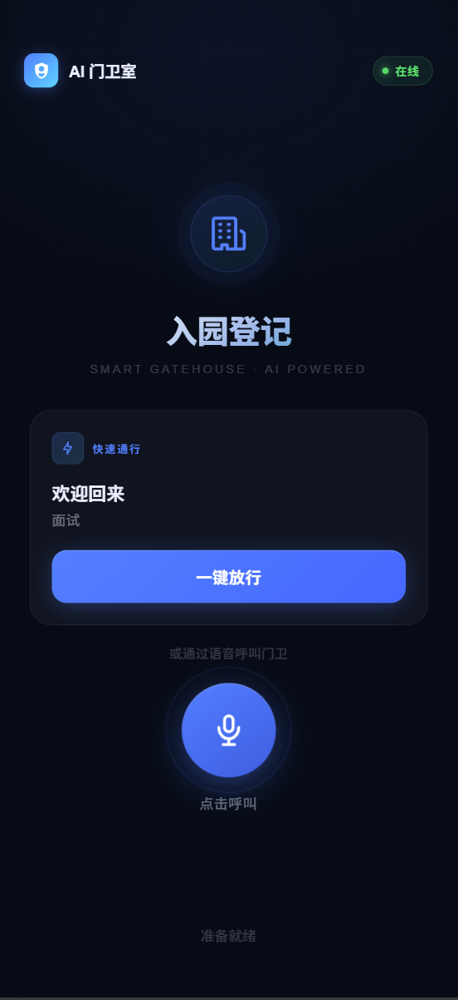

# Day 1

## 语音接入：绕开国内管控的替代方案

开发遇到的第一道坎就是国内对语音外呼的严格管控。文档里提到的 Twilio 已于 2019 年正式退出中国市场，不再提供境内号码的呼出服务；阿里云语音则早已收紧了个人开发者的准入门槛，必须提交企业资质才能申请。走传统"主动拨号"这条路基本堵死了。

最终选择的替代方案是：**扫码后跳转 H5 网页，访客点击按钮，由浏览器发起 WebRTC 语音通话，后端通过 WebSocket 与火山引擎对话 API 双向流式传输音频**。

这个方案有几个明显的好处：

- 不需要任何运营商资质，门槛为零
- 几乎没有呼出延迟，点击即连
- 天然跑在 HTTPS 环境里，音频权限申请流程标准化

代价是无法从通话链路里直接拿到访客手机号，只能在对话中让 AI 开口询问。不过访客识别这块用了另一个思路：页面加载时在 `localStorage` 里随机生成一个 UUID 并持久化，同时查库比对。如果是老访客，就能在数据库里找到对应的历史记录，这部分在后面的"回访识别"里细说。

---

## 语音模型：放弃 OpenAI，选择火山引擎

模型选型上纠结了一段时间。OpenAI Realtime API 在国内网络环境下的连通性实在难以保证，延迟抖动大，不适合用在需要流畅口语交互的场景。

最终用的是**字节跳动火山引擎的实时对话 API**（`volc.speech.dialog`），通过 WSS 长连接与后端直连。选它主要有三个理由：

1. **中文发音更自然**——对话风格口语化，不会有机器腔，和"门卫"这个人设匹配度更高
2. **延迟更低**——国内节点，RTT 比海外服务少一个数量级
3. **成本可控**——按字符计费，对于信息收集这种对话轮次有限的场景，整体花费很少

音频格式定为 PCM 16-bit、单声道，上行 16kHz（ASR 端），下行 24kHz（TTS 端）。

---

## 微信通知：从企业微信到 iLink 的迂回

### 第一版：企业微信

最初用的是企业微信的消息推送接口，验证通过后确实能成功推送来访提醒。


但企业微信做到一半就卡住了——如果要实现"保安在同一窗口用自然语言查询记录"这个功能，就必须接入企业微信的 Webhook 或者内部应用消息接收，前置流程繁琐（公网 IP 白名单、消息加解密、Token 校验……）。更大的问题是：企业微信和普通微信本来就是两个 App，让保安再多装一个并不理想。

我也考虑过单独建一个数据库可视化网页，让 LLM 在那里处理自然语言查询，然后把链接发到企业微信。但这样一来，接收通知和查询数据就分散在两个地方，体验上很割裂。

### 第二版：直接实现 iLink 客户端

我知道 OpenClaw 可以接入微信的 ClawBot，但为了一个数据库查询功能单独跑一个 OpenClaw 实例，代价有点大。搜了一圈之后发现类似产品挺多，再往下追就翻到了开源项目 [cc-weixin](https://github.com/hao-ji-xing/cc-weixin.git)。

读完源码后发现，微信 ClawBot 背后走的是 **iLink 协议**，核心是一个标准的 **HTTP 长轮询（Long Polling）循环**：客户端持续向 `https://ilinkai.weixin.qq.com` 请求，挂起等待，有新消息时服务端才返回，然后立即发下一次请求。这个逻辑用纯 Python asyncio 实现起来并不复杂。

最终在 FastAPI 后端里写了一个轻量级的异步 iLink 客户端，完整替代了 OpenClaw 的这部分功能。整个核心逻辑不到 300 行，没有任何额外框架依赖。

### 最终效果

整条链路跑通后是这样：

```
司机扫码 → H5 页面 → WebSocket 语音通话（火山引擎）
         → LLM 输出结构化 JSON → 写入 SQLite
         → 通过 iLink 推送微信通知给保安
         ↕
    保安在同一对话框用自然语言查询历史记录
```

选择留在普通微信而不是企业微信，主要是考虑到保安平时就用微信，不需要额外安装 App，并且"接收通知 + 自然语言问答"在一个对话框里完成，比在两个地方切来切去更顺手。

---

## 额外功能：回访识别与一键回访

访客打开 H5 页面时，前端会检查 `localStorage` 里有没有 UUID。没有就随机生成一个并写入；有的话就带着这个 UUID 去查库，看有没有历史来访记录。

如果是老访客，页面会额外显示一个**回访快捷按钮**，AI 的 System Prompt 里也会带上上次的车牌、手机、常去单位等信息：

> *"张师傅，还是跟上次一样去华为吗？"*

访客只需要回答"是"，AI 就直接输出带完整信息的 JSON，整个流程不到 10 秒，比重新问一遍省去了大半时间，也节省了不少 token 消耗。


---

## 通话字幕

通话过程中，AI 的回复会实时以文字形式显示在页面上。这个功能在文档需求里没有提，但实现起来成本很低（TTS 流式返回时文本和音频是分开的，直接把文本推给前端就行），而且对于不方便外放、听力不太好的访客或是背景音嘈杂的情况来说体验提升明显——这也是纯电话方案天然做不到的。

---

## 后续想实现的功能（Day 1 末）

- 数据库可视化页面（单独一个后台地址，写死 admin 账号防止数据泄露）
- 点击接通后如果 2 秒内没有声音，AI 主动开口
- 文字输入兜底（考虑无法说话的访客），但不是当前优先级
- 呼叫保安人工协助按钮——避免陷入"用户说叫人，AI 反复追问信息"的死循环

---

# Day 2

## 转人工机制

Day 2 首先补上了 Day 1 留的坑：转人工。

触发条件是多层的，优先级从高到低：

1. **用户明确要求**——说出"叫保安"、"我要人工"之类的关键词，AI 立即一句"好的，稍等"，然后在新行输出 `===HUMAN_TRANSFER===` 信号，后端捕获后推送"人工协助请求"到微信
2. **AI 自主判断**——System Prompt 里明确授权 AI 在感知到访客明显不耐烦、或反复几轮都无法收集齐信息时，主动发出转人工信号
3. **兜底**：对话轮数超过阈值且信息仍不完整，自动转人工

转人工后，后端会在数据库的 `pending_human_cases` 表里留一条记录，把已收集到的部分信息也存下来，方便门卫接手时快速了解情况。

---

## 保安侧：微信自然语言补录

门卫在微信对话框里用自然语言发一条消息，后端的 LLM 会判断意图并分三类处理：

| 类型 | 示例 | 处理方式 |
|------|------|----------|
| **补录访客** | "刚那辆车沪A12345，手机138xxxx，去华为送货" | LLM 解析为结构化 JSON → 写库 → 回复确认 |
| **查询数据库** | "今天来了几辆车" / "找一下沪A12345的记录" | LLM 生成 SQL → 执行 → 二次 LLM 汇报结论 |
| **一般对话** | "帮我看看现在有哪些待处理" | 直接自然语言回答 |

补录时同样做了数据合并：优先按手机号或车牌号匹配已有用户，命中就更新空白字段，不覆盖已有信息；没匹配到才创建新用户。同时会把对应的 `pending_human_cases` 记录标记为 `resolved`。

---

## "正在输入"状态

保安发消息后，ClawBot 会立即显示"正在输入…"的状态指示，等 LLM 处理完再发出真正的回复。这个细节做起来不难，但对交互体验影响很明显——否则保安发完消息后对着空白等几秒，会不确定消息有没有发出去。

---

## 对话上下文（5 轮）

微信侧的 LLM 调用加入了滚动历史，保留最近 5 轮（10 条消息）。这对数据查询追问的场景很有必要：

> 保安："今天来了几辆车？"
> 机器人："共 12 辆。"
> 保安："都是什么时间段来的？"  ← 没有上下文的话 LLM 不知道"都"指什么

---

## SQL 安全拦截

Text-to-SQL 功能有一个显而易见的风险：如果 LLM 被诱导输出 `DROP TABLE` 或者 `UPDATE` 语句，后果会很严重。为此在 SQL 执行前加了一层拦截：

```python
_SQL_DANGEROUS = re.compile(
    r'\b(INSERT|UPDATE|DELETE|DROP|ALTER|CREATE|REPLACE|TRUNCATE|ATTACH|DETACH|PRAGMA|VACUUM)\b',
    re.IGNORECASE
)

def _is_safe_select(stmt: str) -> bool:
    # 先剥离注释，防止 --DROP 这种绕过
    clean = re.sub(r'--[^\n]*', '', stmt)
    clean = re.sub(r'/\*.*?\*/', '', clean, flags=re.DOTALL)
    # 必须以 SELECT 或 WITH 开头
    if not re.match(r'^(SELECT|WITH)\b', clean.strip(), re.IGNORECASE):
        return False
    # 再扫一遍危险关键字
    return not _SQL_DANGEROUS.search(clean)
```

两层过滤：必须以 `SELECT` 或 `WITH`（CTE）开头，且正文中不得出现任何写操作关键字。注释也在比对前剥掉，防止 `SELECT 1; --DROP TABLE users` 这类绕过手法。

---

## 异步非阻塞改造

Day 1 的数据库操作用的是同步 `sqlite3`，跑在 asyncio 事件循环里会阻塞其他请求的处理，在多路并发场景下问题会被放大。Day 2 全面改用 `aiosqlite`，所有数据库调用都变成 `async with aiosqlite.connect(...)` 的异步上下文。

同时为每个微信用户分配一把专属的 `asyncio.Lock`，确保同一用户的并发消息按序处理，历史记录不会乱序或重复写入：

```python
async with _get_user_lock(to_user_id):
    history = _get_history_snapshot(to_user_id)   # 返回独立副本
    # ... LLM 调用 ...
    _append_history(to_user_id, message, reply)
```

---

## UI 优化

这一天做了几个 UI 上的修复和改进：

- 点击回访按钮后，"或通过语音呼叫门卫"的提示文字不再显示（之前忘了处理这个状态）
- 首页 → 通话中的切换加了淡出 + 缩放动画（`opacity + scale`），视觉上更顺滑
- 通话字幕从页面中部移到挂断按钮上方，显示区域更大，不再被按钮遮挡
- 新增通话计时器
- 修复回访按钮流程中多余的"办理"字样



---

## 全双工打断（Barge-in）

因为页面上有实时字幕，有些访客看到 AI 的问题后不等说完就想回答——这完全合理，真实对话本来就是这样的。

实现逻辑：前端检测到麦克风有声音时，立即向后端 WebSocket 发送 `{"type": "interrupt"}` 信令；后端收到后向火山引擎发 `stop_audio`，同时向前端推送停止播放指令。

这里有个需要特别处理的边界情况：如果打断发生时 AI 正好已经生成了完整的访客信息 JSON（存在 `llm_response_buffer` 里），不能清空 buffer——否则后续的校验步骤会找不到数据，白跑了一次对话。所以打断时会先检查 buffer 里有没有 `===JSON_BEGIN===`，有的话只重置静音标志，buffer 保留。

---

## 字段级强类型校验

AI 从语音中识别出来的手机号和车牌，在写库前会经过一个独立的正则校验模块（`validator.py`）。

**手机号规则：** `^1[3-9]\d{9}$`（首位 1，第二位 3-9，共 11 位）

**车牌规则：** 同时覆盖普通蓝牌和新能源绿牌：

```python
_PLATE_NORMAL = rf'[{_PROVINCES}][{_LETTERS}][{_LETTERS}0-9]{{4}}[{_LETTERS}0-9挂学警港澳]'
_PLATE_NEV    = rf'[{_PROVINCES}][{_LETTERS}][DF][{_LETTERS}0-9]{{5}}'
```

校验失败时不是直接报错返回，而是**静默重启一个新的火山引擎 Session**，由 AI 以特定的"纠错开场白"重新追问那一个有问题的字段：

> 校验前（AI 输出 JSON）：`{"phone": "1381234"}`（只有 7 位）
> 校验后（新 Session 开场）：*"刚才您报的手机号格式不对，麻烦重新说一下完整的 11 位手机号。"*

其余已确认的字段不会重新追问，整个纠错流程对访客来说感知很轻微。

---

## 多路并发会话隔离

在本地跑了一个并发压测：多个 WebSocket 连接同时开启，各自发送语音数据，验证 Session 之间不互相污染，历史记录和 UUID 都正确隔离。`asyncio.Lock` + 历史快照（返回独立浅拷贝而非引用）是这里的关键。

---

## iLink 会话窗口限制与保活方案

测试中发现一个平台级的限制：如果保安长时间不回复，ClawBot 主动推送的消息大约发到第 10 条之后，iLink 服务端虽然返回 200，但消息实际上不会投递到微信客户端。这个行为类似 WhatsApp 的 24 小时活跃窗口，属于平台反垃圾策略，无法从代码层面绕过。

解决思路：在后端维护一个"保活短语集合"（"好"、"收到"、"嗯"等），保安发这些词时，后端只刷新 `context_token`，不触发 LLM 调用，也不消耗 token——但窗口计数器重置了。

```python
_KEEPALIVE_PHRASES = {
    "收到", "知道了", "了解", "明白", "好的", "好", "ok", "OK",
    "嗯", "嗯嗯", "哦", "是", "是的", "对", "行", "谢谢", ...
}
```

同时，`context_token` 也会持久化到本地 JSON 文件，服务重启后自动恢复，不会因为重启就丢失已有的会话窗口。

---

## 测试反馈与修复

邀请了朋友做了几轮真实通话测试，收集到两个比较典型的问题：

**问题 1：语速慢会被 AI 插嘴**

原因：VAD（语音活动检测）的静音判定阈值设得太短。访客说号码时习惯在每几位之间停顿一下，结果被 VAD 误判为"说完了"，AI 就开始回复。

修复：将 `silence_duration_ms` 从默认值调整为 `700`ms，给出足够的停顿容忍度。

```json
"vad": { "silence_duration_ms": 700 }
```

**问题 2：AI 会"脑补"没说完的号码**

原因：System Prompt 没有明确禁止 AI 猜测或补全数字。号码说到一半被截断时，AI 有时会基于概率直接填上看起来合理的后几位，悄无声息地编造了一个手机号或车牌。

修复：在 System Prompt 的"严禁幻觉/复述"规则里明确写死：

> *"JSON 中填写的所有内容必须是访客本次通话中明确说出的原始内容。禁止猜测信息，没听清只说'再说一遍'。"*