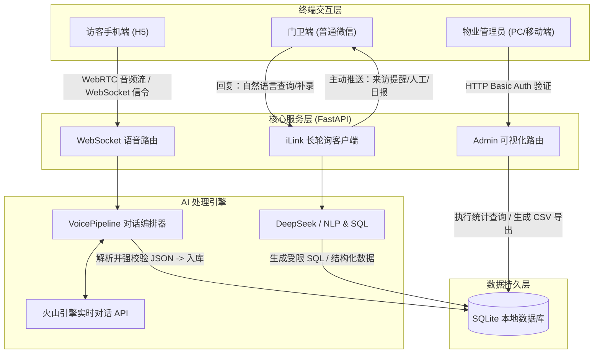

# 智能园区门卫系统

## 架构



## 部署步骤

```bash
# 1. 安装依赖
pip install -r requirements.txt

# 2. 配置环境变量
cp .env.example .env   # 编辑 .env，填入各项 Key

# 3. 启动服务（首次运行在终端打印微信扫码二维码）
python main.py
```

服务监听 `http://0.0.0.0:8000`。访客页面：`/`，物业后台：`/admin`。

公网暴露可用 cloudflared：`cloudflared tunnel --url http://localhost:8000`

## 环境变量

| 变量名 | 说明 | 必填 |
|---|---|---|
| `VOLC_APP_ID` | 火山引擎语音应用 ID | ✅ |
| `VOLC_ACCESS_TOKEN` | 火山引擎语音访问令牌 | ✅ |
| `ARK_API_KEY` | 火山方舟 LLM API Key（保安 Text-to-SQL / 日报生成） | ✅ |
| `ADMIN_PASSWORD` | 物业后台登录密码 | ✅ |
| `ADMIN_URL` | 后台完整 URL（供微信机器人告知门卫，可选） | ❌ |
| `DAILY_REPORT_HOUR` | 每日简报推送小时（默认 `18`） | ❌ |

> 微信登录 Token 首次运行时扫码授权，自动持久化至 `.wechat_token.json`，重启后自动恢复。
